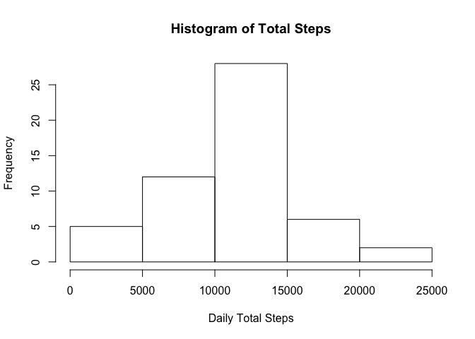
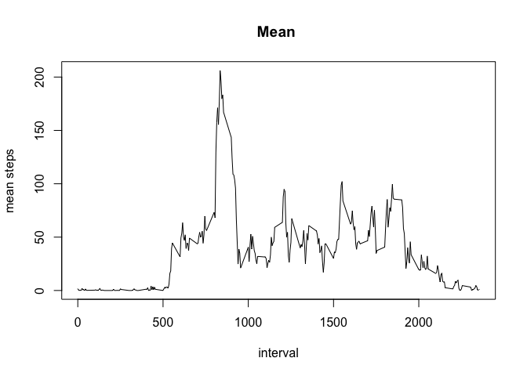
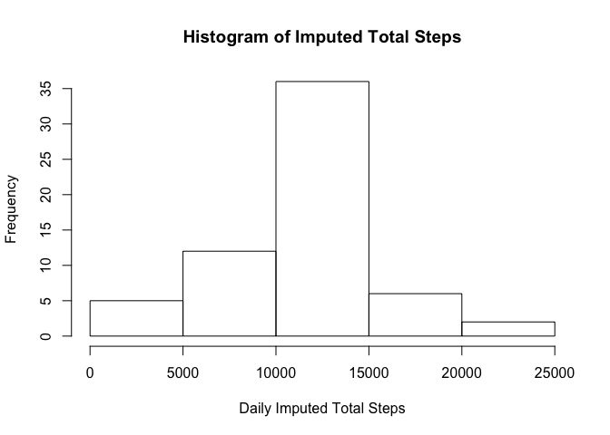
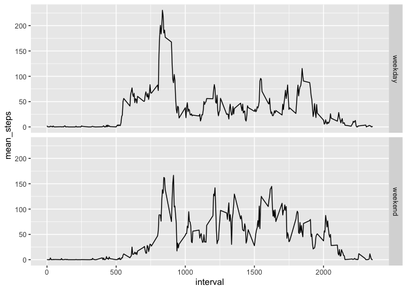

## Loading and preprocessing the data
Let us first load the data into a data frame.


```r
df <- read.csv(file = "activity.csv")
```

## What is mean total number of steps taken per day?
Now let us obtain step totals on a daily basis in a data frame. To do that, first load in the sqldf package.


```r
library(sqldf)
daytotals <- sqldf("SELECT date,SUM(steps) as total_steps from df WHERE steps IS NOT(NULL) GROUP BY date")
print(daytotals)
```

```
##          date total_steps
## 1  2012-10-02         126
## 2  2012-10-03       11352
## 3  2012-10-04       12116
## 4  2012-10-05       13294
## 5  2012-10-06       15420
## 6  2012-10-07       11015
## 7  2012-10-09       12811
## 8  2012-10-10        9900
## 9  2012-10-11       10304
## 10 2012-10-12       17382
## 11 2012-10-13       12426
## 12 2012-10-14       15098
## 13 2012-10-15       10139
## 14 2012-10-16       15084
## 15 2012-10-17       13452
## 16 2012-10-18       10056
## 17 2012-10-19       11829
## 18 2012-10-20       10395
## 19 2012-10-21        8821
## 20 2012-10-22       13460
## 21 2012-10-23        8918
## 22 2012-10-24        8355
## 23 2012-10-25        2492
## 24 2012-10-26        6778
## 25 2012-10-27       10119
## 26 2012-10-28       11458
## 27 2012-10-29        5018
## 28 2012-10-30        9819
## 29 2012-10-31       15414
## 30 2012-11-02       10600
## 31 2012-11-03       10571
## 32 2012-11-05       10439
## 33 2012-11-06        8334
## 34 2012-11-07       12883
## 35 2012-11-08        3219
## 36 2012-11-11       12608
## 37 2012-11-12       10765
## 38 2012-11-13        7336
## 39 2012-11-15          41
## 40 2012-11-16        5441
## 41 2012-11-17       14339
## 42 2012-11-18       15110
## 43 2012-11-19        8841
## 44 2012-11-20        4472
## 45 2012-11-21       12787
## 46 2012-11-22       20427
## 47 2012-11-23       21194
## 48 2012-11-24       14478
## 49 2012-11-25       11834
## 50 2012-11-26       11162
## 51 2012-11-27       13646
## 52 2012-11-28       10183
## 53 2012-11-29        7047
```

For a histogram of daily total steps, we have the following R code.


```r
hist(daytotals$total_steps,main = "Histogram of Total Steps",xlab = "Daily Total Steps")
```

<!-- -->

From the code chunk below, we can obtain that mean and median of the total number of daily steps taken.


```r
print(mean(daytotals$total_steps))
```

```
## [1] 10766.19
```

```r
print(median(daytotals$total_steps))
```

```
## [1] 10765
```

## What is the average daily activity pattern?
Now for the average daily activity pattern, we have that the following pattern.


```r
intervalmeans <- sqldf("SELECT interval,AVG(steps) as mean_steps from df WHERE steps IS NOT(NULL) GROUP BY interval")
plot(y = intervalmeans$mean_steps,x = intervalmeans$interval,type = "l",xlab = "interval",ylab= "mean steps",main = "Mean ")
```

<!-- -->

From the code chunk below, we get that the 167th 5-minute interval i.e interval marked as 835 has the highest average daily mean steps.


```r
max_mean_steps <- max(intervalmeans$mean_steps)
subset(x = intervalmeans,intervalmeans$mean_steps == max_mean_steps,select = 1)
```

```
##     interval
## 104      835
```

## Imputing missing values
First subset the data that has missing values and then count the number of missing values in that datframe.


```r
missingdf <- subset(df,is.na(df$steps))
length(missingdf$steps) # Hence 2304 missing values
```

```
## [1] 2304
```

Consider replacing missing values with the mean of values for that time interval over all days.


```r
imputed_df <- df
length_df <- nrow(imputed_df) # Length of the data frame
for(i in 1:length_df){
  if(is.na(imputed_df[i,1])){
    imputed_df[i,1] <- subset(intervalmeans,intervalmeans$interval == imputed_df[i,3])[1,2]
  }
}
```

Following is the histogram of the imputed data frame.


```r
imputedtotals <- sqldf("SELECT date,SUM(steps) as total_steps from imputed_df GROUP BY date") # This data frame has daily step totals
hist(imputedtotals$total_steps,main = "Histogram of Imputed Total Steps",xlab = "Daily Imputed Total Steps")
```

<!-- -->

```r
print(mean(imputedtotals$total_steps))
```

```
## [1] 10766.19
```

```r
print(median(imputedtotals$total_steps))
```

```
## [1] 10766.19
```

It can be seen from above that mean of total daily steps hasn't changed even with imputation which can be easily proven.
However, the median has slightly moved higher as a result of imputation.

## Are there differences in activity patterns between weekdays and weekends?
Use the imputed data frame to assign a factor variable for weekdays.


```r
library(timeDate) # This package has useful functions for time-date conversions
imputed_df$category <- isWeekday(as.Date(imputed_df$date))
for(i in 1:length_df){
  if(imputed_df[i,4]){
    imputed_df[i,4] <- "weekday"
  }
  else{
    imputed_df[i,4] <- "weekend"
  }
}
```

The following code creates the required time series panel plot. 


```r
library(ggplot2)
imputed_intervalmeans <- sqldf("SELECT interval,category, AVG(steps) as mean_steps from imputed_df WHERE steps IS NOT(NULL) GROUP BY category,interval")
gplt <- ggplot(imputed_intervalmeans, aes(x = interval,y = mean_steps))+geom_line()+facet_grid(category ~.)
print(gplt)
```

<!-- -->

Hence it can be seen that there are differences in activity patterns between weekdays and weekends.
